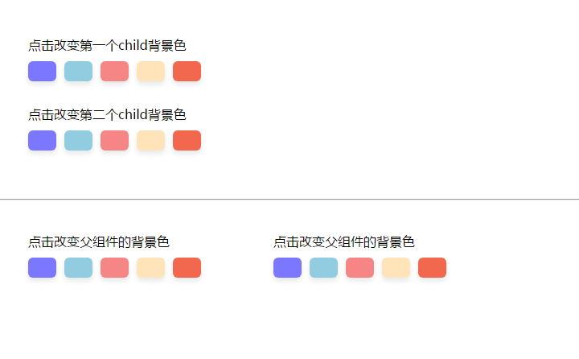
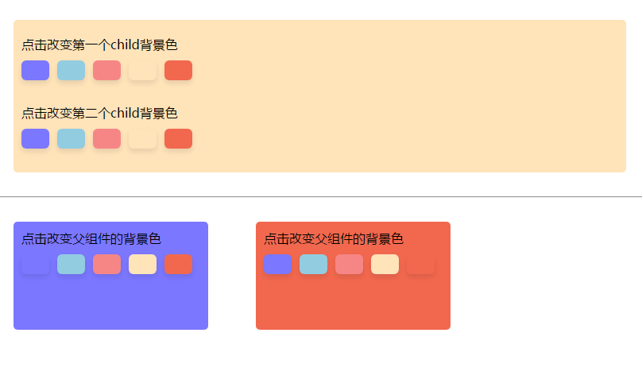

本示例使用es6编写react，关于es6与es5编写react的不同，可查看[如何使用es6编写react](https://babeljs.io/blog/2015/06/07/react-on-es6-plus)。

网上关于react的demo大多是非常基础的，很多只是展示如何使用react渲染出一个标题。本示例参考了[react常用demo](http://blog.csdn.net/iambinger/article/details/51803606),
将其es5写法改为了es6。


### 一.最终效果
* 点击两个子组件中的任何一个颜色块，父组件区域则会呈现相应的背景色
* 点击父组件中两个颜色块，分别改变相应的子组件区域的背景色






     
### 二.组件编写

#### 1.编写子组件
  
  点击子组件上的a标签颜色块时，属性changeParentColor接受父组件传递过来的方法changeParentBgColor()，
  将父组件背景色更改为当前点击的a标签data-color中储存的值。

    ``` 
         //切换子组件背景色
         class SwitchBgChild extends React.Component<any, any> {
         
             defaultProps = {
                 changeParentColor: ''
             };
         
             render() {
         
                 return (
                     <div className="child">
                         <p>点击改变父组件的背景色</p>
                         <ul>
                             <li><a data-color="#7B77FF" onClick={this.props.changeParentColor}>&nbsp;</a></li>
                             <li><a data-color="#92CCE1" onClick={this.props.changeParentColor}>&nbsp;</a></li>
                             <li><a data-color="#F68686" onClick={this.props.changeParentColor}>&nbsp;</a></li>
                             <li><a data-color="#FFE3B9" onClick={this.props.changeParentColor}>&nbsp;</a></li>
                             <li><a data-color="#F1684E" onClick={this.props.changeParentColor}>&nbsp;</a></li>
                         </ul>
                     </div>
                 )
             }
         }
         
    ```
    
#### 2.编写父组件
  
  点击父组件上的a标签颜色块时，分别调用changeChild1Color()和changeChild2Color()两个方法，修改相应的子组件的背景色。
  注意的是，修改子组件的背景色时，要给需要获取节点的元素增加ref属性，使用ReactDom.findDOMNode(this.refs.属性名)来寻找真实的dom节点。
  * react0.14.8版本及以前用 this.getDOMNode() 或者 this.findDOMNode(this.refs.属性名)
  * react15.0版本以后需要用 ReactDOM.findDOMNode(this.refs.属性名);
  
    ``` 
          //切换父组件背景色
                  class SwitchBgParent extends React.Component<any, any> {
                  
                      state = {
                          parentBgColor: ''
                      };
                  
                      //改变父组件背景色
                      changeParentBgColor(e){
                          this.setState({parentBgColor: e.target.getAttribute("data-color")})
                      };
                  
                  
                      //改变子组件1背景色
                      changeChild1Color(e){
                          ReactDom.findDOMNode(this.refs.child1).style.background=e.target.getAttribute("data-color");
                      };
                  
                      //改变子组件2背景色
                      changeChild2Color(e){
                          ReactDom.findDOMNode(this.refs.child2).style.background=e.target.getAttribute("data-color");
                      };
                  
                  
                      render() {
                          let {parentBgColor} = this.state;
                          return (
                              <div>
                                  <div style={{"background": parentBgColor}} className="parent">
                                      <div>
                                          <p>点击改变第一个child背景色</p>
                                          <ul>
                                              <li><a data-color="#7B77FF" onClick={this.changeChild1Color.bind(this)}>&nbsp;</a></li>
                                              <li><a data-color="#92CCE1" onClick={this.changeChild1Color.bind(this)}>&nbsp;</a></li>
                                              <li><a data-color="#F68686" onClick={this.changeChild1Color.bind(this)}>&nbsp;</a></li>
                                              <li><a data-color="#FFE3B9" onClick={this.changeChild1Color.bind(this)}>&nbsp;</a></li>
                                              <li><a data-color="#F1684E" onClick={this.changeChild1Color.bind(this)}>&nbsp;</a></li>
                                          </ul>
                                      </div>
                                      <div>
                                          <span>点击改变第二个child背景色</span>
                                          <ul>
                                              <li><a data-color="#7B77FF" onClick={this.changeChild2Color.bind(this)}>&nbsp;</a></li>
                                              <li><a data-color="#92CCE1" onClick={this.changeChild2Color.bind(this)}>&nbsp;</a></li>
                                              <li><a data-color="#F68686" onClick={this.changeChild2Color.bind(this)}>&nbsp;</a></li>
                                              <li><a data-color="#FFE3B9" onClick={this.changeChild2Color.bind(this)}>&nbsp;</a></li>
                                              <li><a data-color="#F1684E" onClick={this.changeChild2Color.bind(this)}>&nbsp;</a></li>
                                          </ul>
                                      </div>
                                  </div>
                                  <hr/>
                                  <SwitchBgChild ref="child1" changeParentColor={this.changeParentBgColor.bind(this)}/>
                                  <SwitchBgChild ref="child2" changeParentColor={this.changeParentBgColor.bind(this)}/>
                              </div>
                          )
                      }
                  }

    ```
    
#### 3.导入及导出

记得在头部导入相关的库，如本示例所需要的：

    ```
        import * as React from 'react';
        import * as ReactDom from 'react-dom';
    
    ```
    
在最后导出组件
      
    ```
        export default SwitchBgParent;
          
    ```


    
   
